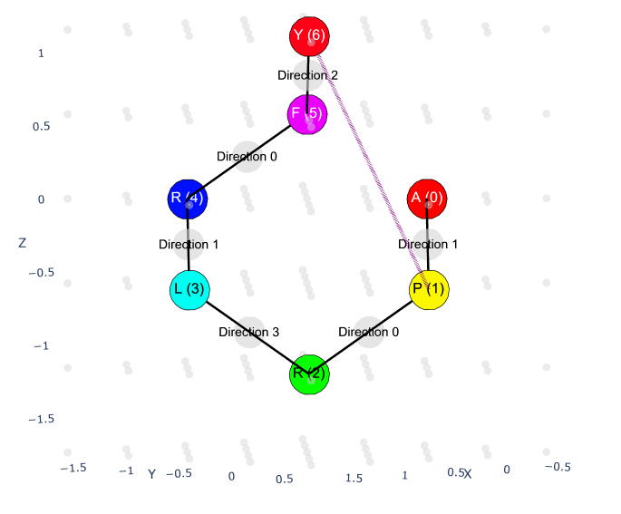

[![Contributors][contributors-shield]][contributors-url]
[![Forks][forks-shield]][forks-url]
[![Stargazers][stars-shield]][stars-url]
[![Issues][issues-shield]][issues-url]
[![License][license-shield]][license-url]

[contributors-shield]: https://img.shields.io/github/contributors/QFold-Thesis/quantum-protein-folding?style=flat-square
[contributors-url]: https://github.com/QFold-Thesis/quantum-protein-folding/graphs/contributors
[forks-shield]: https://img.shields.io/github/forks/QFold-Thesis/quantum-protein-folding?style=flat-square
[forks-url]: https://github.com/QFold-Thesis/quantum-protein-folding/network/members
[stars-shield]: https://img.shields.io/github/stars/QFold-Thesis/quantum-protein-folding?style=flat-square
[stars-url]: https://github.com/QFold-Thesis/quantum-protein-folding/stargazers
[issues-shield]: https://img.shields.io/github/issues/QFold-Thesis/quantum-protein-folding?style=flat-square
[issues-url]: https://github.com/QFold-Thesis/quantum-protein-folding/issues
[license-shield]: https://img.shields.io/github/license/QFold-Thesis/quantum-protein-folding?style=flat-square
[license-url]: https://github.com/QFold-Thesis/quantum-protein-folding/blob/main/LICENSE

# Quantum Protein Folding
<div align="center">
  <a href="https://github.com/QFold-Thesis/quantum-protein-folding">
    
  </a>
</div>

A quantum computing approach to solving the protein folding problem using [Qiskit](https://qiskit.org/). This project implements Variational Quantum Eigensolver (VQE) algorithm to predict the 3D structure of proteins based on their amino acid sequence. 

Our implementation is **inspired by and extends** the methods described in  
[*Protein Folding Problem: A Quantum Approach*](https://arxiv.org/pdf/1908.02163), and this repository: [quantum-protein-folding-qiskit](https://github.com/qiskit-community/quantum-protein-folding)

## 🧬 Overview

Protein folding is one of the most challenging problems in computational biology. This project leverages quantum computing to explore protein conformations on a lattice model, using quantum optimization to find low-energy states that represent folded protein structures.

The implementation uses:
- **Qiskit** for quantum circuit construction and simulation
- **VQE (Variational Quantum Eigensolver)** for quantum optimization
- **Hamiltonian formulation** combining distance constraints, contact interactions, and backtracking penalties
- **HP and MJ interaction models** for residue-residue energies

## ✨ Features

- 🔬 **Multiple interaction models**: Hydrophobic-Polar (HP) and Miyazawa-Jernigan (MJ)
- ⚛️ **Quantum backend support**: IBM Quantum and local simulator
- 📊 **Rich visualizations**: 2D projections, interactive 3D plots, and animated rotations
- 📈 **Result tracking**: Detailed logging of VQE iterations, energies, and convergence

## 🎨 Visualizations

The quantum optimization produces protein conformations that can be visualized in multiple ways:

### Interactive 3D Visualization
<p align="center">
  <a href="https://qfold-thesis.github.io/quantum-protein-folding/assets/interactive_3d_visualization.html" target="_blank">
    
  </a>
  <br>
  <em><b>Click</b> to view the interactive 3D visualization (HTML)</em>
</p>

### Rotating Animation
<p align="center">
  
  <br>
  <em>Animated 360° rotation of the folded protein structure</em>
</p>

The visualizations show:
- **Backbone chain** (main chain beads) in one color
- **Residue labels** for each amino acid position
- **3D spatial arrangement** on a discrete lattice
- **Energy-minimized conformation** from VQE optimization

## 📋 Requirements

- Python 3.12 or higher
- [`uv`](https://github.com/astral-sh/uv) - Fast Python package and environment manager

## 🚀 Installation

### 1. Install `uv`

Choose one of the following methods:

**Linux/macOS:**
```bash
curl -LsSf https://astral.sh/uv/install.sh | sh
```

**Windows (PowerShell):**
```powershell
powershell -ExecutionPolicy ByPass -c "irm https://astral.sh/uv/install.ps1 | iex"
```

**Alternative (via pip):**
```bash
pip install uv
```

### 2. Clone the Repository

```bash
git clone https://github.com/QFold-Thesis/quantum-protein-folding.git
cd quantum-protein-folding
```

### 3. Setup Virtual Environment and Dependencies

```bash
uv sync
```

This command:
- Creates a virtual environment in `.venv/`
- Installs all dependencies from `pyproject.toml`
- Sets up the development environment

### 4. (Optional) Configure IBM Quantum Access

To use IBM Quantum hardware or cloud simulators:

1. Create a `.env` file in the project root:
```bash
cp .env.example .env
```

2. Add your IBM Quantum API token to `.env`:
```
IBM_QUANTUM_TOKEN="your_token_here"
```

Get your token from [IBM Quantum](https://quantum.ibm.com/).

## 🎯 Usage

### Run a Basic Simulation

```bash
uv run src/main.py
```

This will:
1. Fold the default protein sequence (`APRLRFY`)
2. Run VQE optimization using a quantum simulator
3. Generate visualizations in the `output/` directory
4. Save results including energies, conformations, and plots

### Customize the Protein Sequence

Edit `src/main.py` to change the sequence:

```python
def main() -> None:
    main_chain: str = "APRLRFY"  # Change this to your sequence
    side_chain: str = EMPTY_SIDECHAIN_PLACEHOLDER * len(main_chain)
    # ... rest of the code
```

### Configure Backend and Interaction Model

Edit `src/constants.py` to adjust:
- `CONFORMATION_ENCODING`: `ConformationEncoding.DENSE` or `ConformationEncoding.SPARSE`
- Backend settings for IBM Quantum or local simulators
- Interaction model: HP or MJ

### View Results

After running, check the `output/` directory for timestamped folders containing:
- `interactive_3d_visualization.html` - Interactive 3D plot (open in browser)
- `rotating_3d_visualization.gif` - Animated rotation
- `conformation_2d.png` - 2D projection
- `conformation.xyz` - XYZ coordinate file
- `raw_vqe_results.json` - Detailed VQE output
- `vqe_iterations.txt` - Iteration-by-iteration energies

## 📖 Documentation (Sphinx)

The documentation for this repository is automatically built and deployed to GitHub Pages. You can view the latest published docs at:

https://qfold-thesis.github.io/quantum-protein-folding

You can also build the documentation locally with Sphinx. If you use `uv` as the project environment manager, the following command will run the Sphinx builder inside the project's environment:

```bash
uv run sphinx-build -b html docs/sphinx docs/sphinx/_build/html
```

After a successful build the generated HTML files will be placed in `docs/sphinx/_build/html`.

## 🧪 Running Tests

```bash
uv run pytest -v -s
```

For specific test modules:
```bash
uv run pytest tests/test_protein.py -v
```

## 📦 Adding Dependencies

To add a new package:

```bash
uv add <package-name>
```

For development dependencies:

```bash
uv add --dev <package-name>
```

## 🏗️ Project Structure

```
quantum-protein-folding/
├── docs/                 # Sphinx documentation and README
├── src/
│   ├── backend/          # Quantum backend configurations
│   ├── builder/          # Hamiltonian construction
│   ├── contact/          # Contact map generation
│   ├── distance/         # Distance operator builders
│   ├── interaction/      # HP and MJ interaction models
│   ├── protein/          # Protein, chain, and bead classes
│   ├── result/           # Result interpretation and visualization
│   ├── utils/            # Utility functions
│   ├── constants.py      # Global constants
│   ├── enums.py          # Enumerations
│   └── main.py           # Main entry point
├── tests/                # Unit tests
├── output/               # Generated results and visualizations
├── pyproject.toml        # Project metadata and dependencies
├── .env.example          # Example of .env file
├── ruff.toml             # Ruff configuration
```

## 🔬 How It Works

1. **Protein Representation**: Proteins are modeled as chains of beads on a tetrahedral lattice, with each bead representing an amino acid residue.

2. **Quantum Encoding**: Turn directions at each position are encoded into qubits using either sparse (more qubits) or dense (fewer qubits) encoding schemes.

3. **Hamiltonian Construction**: A quantum Hamiltonian is built combining:
   - Contact interaction energies (HP or MJ model)
   - Distance constraints between beads
   - Backtracking penalties

4. **VQE Optimization**: A variational quantum eigensolver finds the ground state (minimum energy) configuration.

5. **Result Interpretation**: The optimal quantum state is decoded into 3D coordinates and visualized.

## 📚 Key Modules

- **`protein/`**: Models proteins as main/side chains composed of beads with quantum turn operators
- **`interaction/`**: Provides pairwise residue energies (HP or MJ models)
- **`builder/`**: Constructs the full Hamiltonian from protein structure and interactions
- **`backend/`**: Manages quantum backends (IBM Quantum, simulators)
- **`result/`**: Interprets VQE results and generates visualizations

## 🤝 Contributing

Contributions are welcome! Please feel free to submit issues or pull requests.

## 🧞 Authors

Anna Sztukowska
Stefan Furmański
Lucjan Gackowski
Gracjan Żukowski

## 📄 License

This project is released under the terms of the MIT license. See the `LICENSE` file for details.