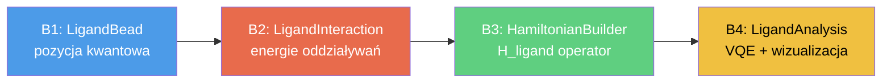
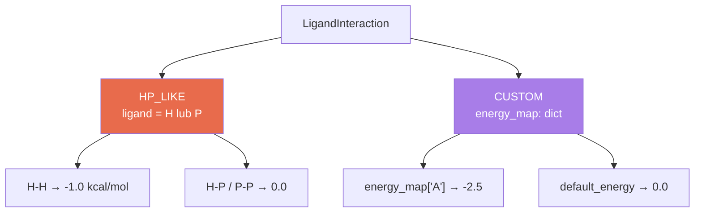
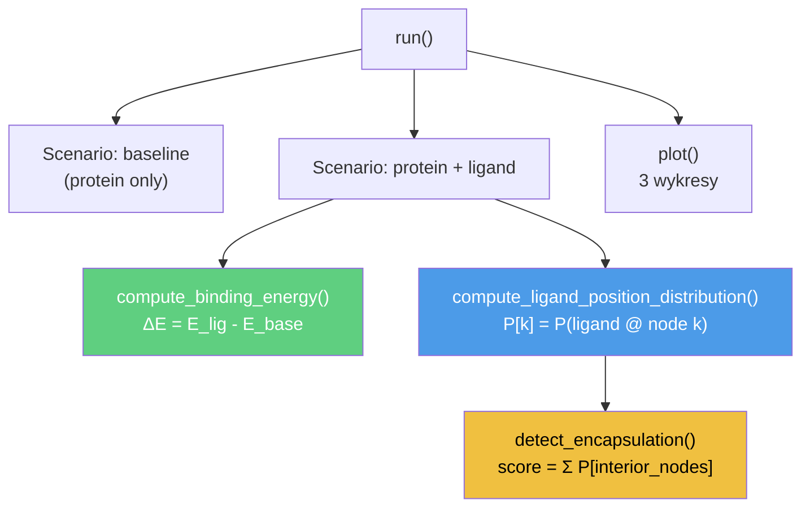

# Ligand Modelling Pipeline — Session Walkthrough

> **Projekt:** quantum-protein-folding  
> **Sesja:** 2026-05-25 → 2026-05-30  
> **Cel:** Modelowanie liganda (małej cząsteczki) jako wolno poruszającego się beada na kratce kwantowej, integracja z Hamiltonianem, analiza oddziaływań.

---

## Spis treści

1. [Przegląd etapów](#przegląd-etapów)
2. [Etap B1 — LigandBead](#etap-b1--ligandbead)
3. [Etap B2 — LigandInteraction](#etap-b2--ligandinteraction)
4. [Etap B3 — Integracja z Hamiltonianem](#etap-b3--integracja-z-hamiltonianem)
5. [Etap B4 — LigandAnalysis](#etap-b4--ligandanalysis)
6. [Mapa plików](#mapa-plików)
7. [Pokrycie testami](#pokrycie-testami)
8. [Decyzje projektowe](#decyzje-projektowe)
9. [Ograniczenia i następne kroki](#ograniczenia-i-następne-kroki)

---

## Przegląd etapów



| Etap | Opis | Nowe pliki | Testy |
|------|------|-----------|-------|
| **B1** | Klasa `LigandBead` z qubitami pozycji (BINARY/UNARY) | `ligand_bead.py` | 49 |
| **B2** | Klasa `LigandInteraction` z trybami HP_LIKE/CUSTOM | `ligand_interaction.py` | 82 |
| **B3** | Metoda `_build_ligand_contact_term()` w Hamiltonianie | (modyfikacja) `hamiltonian_builder.py` | 23 |
| **B4** | Klasa `LigandAnalysis` z VQE, wizualizacją, heurystyką | `ligand_analysis.py` | 55 |
| | | **Suma** | **209** |

---

## Etap B1 — LigandBead

### Plik: [ligand_bead.py](file:///c:/repos/quantum-protein-folding/src/particle/ligand_bead.py)

Ligand modelowany jako **pojedynczy, wolny bead** na kratce — bez wiązania łańcuchowego, bez qubitów skrętów. Pozycja kodowana wyłącznie qubitami pozycyjnymi.

#### Enkodowanie pozycji — dwie strategie

| Cecha | BINARY | UNARY |
|-------|--------|-------|
| Liczba qubitów | ⌈log₂(N)⌉ | N |
| 16-węzłowa kratka | **4 qubity** | 16 qubitów |
| Projektor P(k) | Iloczyn tensorowy ½(I±Z) per bit | Pojedynczy ½(I-Z_k) |
| Σ_k P(k) w pełnej przestrzeni | = I | = ½(N·I - Σ Z_k) |
| Rekomendacja | ✅ Domyślny — qubit-efektywny | Mały lattice / proste projektory |

#### Kluczowe API

```python
from particle.ligand_bead import LigandBead, PositionEncoding

lig = LigandBead(symbol="L", index=0, num_lattice_nodes=8)
print(lig.num_position_qubits)        # → 3  (ceil(log2(8)))

P_3 = lig.position_projector(3)       # projektor na węzeł 3
# → SparsePauliOp, 3-qubitowy operator
```

#### Decyzja: niezależna klasa (nie dziedziczy z `Bead`)

`Bead` wymaga `parent_chain_len` i turn-qubitów — ligand nie ma żadnego z tych elementów. Wymuszanie dziedziczenia prowadziłoby do `NotImplementedError` na każdej metodzie abstrakcyjnej.

> [!NOTE]
> Testy: [test_ligand_bead.py](file:///c:/repos/quantum-protein-folding/tests/test_ligand_bead.py) — **49 testów** (walidacja konstruktora, liczba qubitów, poprawność projektorów, edge cases).

---

## Etap B2 — LigandInteraction

### Plik: [ligand_interaction.py](file:///c:/repos/quantum-protein-folding/src/interaction/ligand_interaction.py)

Model oddziaływania liganda z pojedynczym aminokwasem łańcucha.

#### Dwa tryby



| Cecha | HP_LIKE | CUSTOM |
|-------|---------|--------|
| Parametry | `ligand_hp_type` = "H" / "P" | `energy_map`, `default_energy` |
| Źródło energii | Macierz HP (plik) | Użytkownik |
| Zastosowanie | Szybkie prototypowanie | Eksperymentalne dane bindowania |

#### API — metody fabrykujące

```python
from interaction.ligand_interaction import LigandInteraction

# HP-like
lig_hp = LigandInteraction.hp_like(ligand_hp_type="H")
lig_hp.get_energy("A")  # → -1.0  (A jest hydrofobowy)

# Custom
lig_cu = LigandInteraction.custom(
    energy_map={"A": -2.5, "K": -0.3},
    default_energy=0.0,
)
lig_cu.get_energy("G")  # → 0.0  (default)
```

> [!NOTE]
> Testy: [test_ligand_interaction.py](file:///c:/repos/quantum-protein-folding/tests/test_ligand_interaction.py) — **82 testy** (oba tryby, walidacja, edge cases, `all_energies()`, `repr`).

---

## Etap B3 — Integracja z Hamiltonianem

### Plik: [hamiltonian_builder.py](file:///c:/repos/quantum-protein-folding/src/builder/hamiltonian_builder.py) (modyfikacja)

#### Nowa metoda: `_build_ligand_contact_term()`

Buduje operator `H_ligand` w przestrzeni `ℋ_protein ⊗ ℋ_ligand`:

```
H_ligand = Σ_i  E_i · I_prot ⊗ Σ_k P_L^(k)
```

gdzie:
- `E_i = ligand_interaction.get_energy(aminokwas_i)` — energia dla i-tego beada
- `P_L^(k)` — projektor pozycyjny liganda na węzeł k
- `I_prot` — identyczność na rejestrze białkowym

#### Architektura rejestru qubitowego

```
┌───────────────────────────────────────────────┐
│           protein_qubits (24)                 │ ⊗ │ n_pos (2/4) │
│  backbone (distance) + backtrack + turn       │   │ BINARY/UNARY│
└───────────────────────────────────────────────┘   └─────────────┘
                                                    
H_total = pad(H_backbone) + pad(H_backtrack) + pad(H_field) + H_ligand
          ←── 24q padded to 26/28 ──→              ←── 26/28q ──→
```

#### Zmodyfikowana metoda: `sum_hamiltonians()`

```python
def sum_hamiltonians(
    self,
    ligand: LigandBead | None = None,
    ligand_interaction: LigandInteraction | None = None,
) -> SparsePauliOp:
```

- Bez argumentów → backwards-compatible (identyczny wynik jak przed)
- Z ligandem → `target_qubits = protein_qubits + n_pos`
- `ligand` i `ligand_interaction` muszą być oba `None` lub oba podane (otherwise `ValueError`)

> [!IMPORTANT]
> **Wariant A** (scalar shift): `Σ_k P_L^(k) = I_lig` w BINARY, więc H_ligand upraszcza się do `(Σ_i E_i) · I_total`. W UNARY suma projektorów = `(N/2)·I` w pełnej przestrzeni Hilberta (ale = `I` w fizycznej podprzestrzeni one-hot).

> [!NOTE]
> Testy: [test_hamiltonian_ligand.py](file:///c:/repos/quantum-protein-folding/tests/test_hamiltonian_ligand.py) — **23 testy** (backward compat, qubit count, identity coeff, BINARY vs UNARY, error handling).

---

## Etap B4 — LigandAnalysis

### Plik: [ligand_analysis.py](file:///c:/repos/quantum-protein-folding/src/analysis/ligand_analysis.py)

Klasa orkiestrująca pełny workflow analizy liganda: budowanie Hamiltonianu → VQE → post-processing → wizualizacja.

#### Trzy metody analityczne



##### 1. `compute_binding_energy()` → `float`

```
ΔE_binding = E(protein+ligand) − E(protein alone)
```

- **ΔE < 0** → stabilizacja (korzystne wiązanie)
- W Wariancie A: ΔE ≈ Σ_i E_i (suma energii oddziaływania liganda z każdym aminokwasem)

##### 2. `compute_ligand_position_distribution()` → `list[float]`

Marginalizacja quasi-dystrybucji VQE po qubitach białkowych:

| Kodowanie | Interpretacja bitstringu |
|-----------|--------------------------|
| BINARY | Ostatnie `n_pos` bitów → `int(bits, 2)` = node index |
| UNARY | Pozycja bitu '1' w ostatnich N bitach = node index |

Wynik normalizowany do sumy = 1.0.

##### 3. `detect_encapsulation()` → `EncapsulationResult`

Heurystyka geometryczna:
1. Podział węzłów na **interior** (centralne `interior_fraction` kratki) i **boundary**
2. `score = Σ P[k]` dla k ∈ interior
3. `is_encapsulated = (score ≥ threshold)`

#### Wizualizacja — 3 wykresy

| Wykres | Plik | Zawartość |
|--------|------|-----------|
| Position distribution | `ligand_position_distribution.png` | Bar chart P(node_k) |
| Energy comparison | `energy_comparison.png` | Baseline vs. with-ligand |
| Lattice heatmap | `lattice_heatmap.png` | 2D heatmap + zielone obramowanie interior |

#### Gotowe eksperymenty

```python
# 1. HP: hydrofobowy ligand przy sekwencji HP
from analysis.ligand_analysis import run_hp_hydrophobic_experiment
hp = run_hp_hydrophobic_experiment(
    main_chain="HPPHH", num_lattice_nodes=8, output_dir=Path("output/hp")
)

# 2. MJ: silnie oddziałujący ligand custom
from analysis.ligand_analysis import run_mj_strong_ligand_experiment
mj = run_mj_strong_ligand_experiment(
    main_chain="ACDEFGH", num_lattice_nodes=8, output_dir=Path("output/mj")
)
```

> [!NOTE]
> Testy: [test_ligand_analysis.py](file:///c:/repos/quantum-protein-folding/tests/test_ligand_analysis.py) — **55 testów** (inicjalizacja, run(), binding energy, position distribution, encapsulation, plotting, experiment functions).

---

## Mapa plików

### Nowe pliki źródłowe

| Plik | Linie | Opis |
|------|-------|------|
| [src/particle/ligand_bead.py](file:///c:/repos/quantum-protein-folding/src/particle/ligand_bead.py) | 297 | `LigandBead`, `PositionEncoding` |
| [src/interaction/ligand_interaction.py](file:///c:/repos/quantum-protein-folding/src/interaction/ligand_interaction.py) | 432 | `LigandInteraction`, `LigandInteractionMode` |
| [src/analysis/ligand_analysis.py](file:///c:/repos/quantum-protein-folding/src/analysis/ligand_analysis.py) | ~600 | `LigandAnalysis`, `LigandScenarioResult`, `EncapsulationResult` |

### Zmodyfikowane pliki

| Plik | Zmiana |
|------|--------|
| [src/builder/hamiltonian_builder.py](file:///c:/repos/quantum-protein-folding/src/builder/hamiltonian_builder.py) | `_build_ligand_contact_term()`, `sum_hamiltonians(ligand=, ligand_interaction=)` |
| [src/interaction/\_\_init\_\_.py](file:///c:/repos/quantum-protein-folding/src/interaction/__init__.py) | Eksport `LigandInteraction` |
| [src/analysis/\_\_init\_\_.py](file:///c:/repos/quantum-protein-folding/src/analysis/__init__.py) | Eksport `LigandAnalysis`, `EncapsulationResult`, experiment functions |

### Nowe pliki testów

| Plik | Testy |
|------|-------|
| [tests/test_ligand_bead.py](file:///c:/repos/quantum-protein-folding/tests/test_ligand_bead.py) | 49 |
| [tests/test_ligand_interaction.py](file:///c:/repos/quantum-protein-folding/tests/test_ligand_interaction.py) | 82 |
| [tests/test_hamiltonian_ligand.py](file:///c:/repos/quantum-protein-folding/tests/test_hamiltonian_ligand.py) | 23 |
| [tests/test_ligand_analysis.py](file:///c:/repos/quantum-protein-folding/tests/test_ligand_analysis.py) | 55 |

---

## Pokrycie testami

```
312 passed, 22 warnings in 183.73s (0:03:03)
```

| Kategoria testów | Liczba | Status |
|-------------------|--------|--------|
| LigandBead (B1) | 49 | ✅ |
| LigandInteraction (B2) | 82 | ✅ |
| Hamiltonian + Ligand (B3) | 23 | ✅ |
| LigandAnalysis (B4) | 55 | ✅ |
| External Field (wcześniejsze) | 41 + 1 | ✅ |
| Field Influence Analysis | 35 | ✅ |
| Pozostałe (utils itp.) | 26 | ✅ |
| **Łącznie** | **312** | **✅** |

---

## Decyzje projektowe

### 1. Niezależna klasa `LigandBead` vs. dziedziczenie z `Bead`

| Argument | Wybór |
|----------|-------|
| `Bead` wymaga turn-qubitów | LigandBead ma pozycyjne |
| `Bead` ma `parent_chain_len` | Ligand nie jest w łańcuchu |
| Przyszłe rozszerzenia (orientacja, ruchliwość) | Niezależna klasa → łatwiejsze |
| **Decyzja** | **Niezależna klasa** ✅ |

### 2. BINARY vs UNARY encoding

| Argument | BINARY (domyślny) | UNARY |
|----------|-------------------|-------|
| Efektywność qubitowa | ⌈log₂N⌉ | N |
| Prostota projektorów | Iloczyn tensorowy | Pojedynczy ½(I-Z) |
| Fizyczna interpretowalność | Standard | One-hot naturalne |
| **Rekomendacja** | **✅ Domyślny** | Małe kratki |

### 3. Standalone `LigandInteraction` vs. podklasa `Interaction`

ABC `Interaction` ma symetryczny interfejs `get_energy(sym_i, sym_j)` i wymaga pliku macierzy. Ligand jest asymetryczny i CUSTOM mode nie używa żadnego pliku. Standalone unika sztucznych obejść.

### 4. Wariant A (scalar shift) vs. Wariant B (pełny δ(r_i, r_L))

> [!WARNING]
> **Aktualnie zaimplementowany jest Wariant A.** Beady białka nie mają własnych qubitów pozycji — ich pozycja jest *implicite* zakodowana w turn-qubitach przez `DistanceMap`. Wariant B wymaga jawnych projektorów `P_bead_i^(k)`, co stanowi osobny etap rozszerzenia modelu.

---

## Ograniczenia i następne kroki

### Znane ograniczenia

1. **Wariant A** — H_ligand jest scalar shift → ligand nie jest przestrzennie sprzężony z białkiem
2. **Rozkład pozycyjny** — wynika z preferencji ansatzu VQE, nie z fizycznego sprzężenia
3. **Enkapsulacja** — heurystyka 1D (centralne węzły = interior), nie geometria 3D
4. **CVaR** — stochastyczność VQE powoduje zmienność wyników między uruchomieniami

### Możliwe rozszerzenia

| Rozszerzenie | Opis | Wymagania |
|-------------|------|-----------|
| **Wariant B** | δ(r_i, r_L) sprzężenie z pozycyjnymi projektorami białka | Qubity pozycji per bead |
| **Multiple ligands** | Wektor ligandów na kratce | Rozszerzenie `sum_hamiltonians()` |
| **Ligand-ligand** | Oddziaływania między ligandami | Nowa klasa interakcji |
| **3D kratka** | Realistyczna geometria kratki | Rzeczywiste współrzędne węzłów |
| **Constraint** | Wykluczanie overlap protein–ligand | Penalty term w H |

---

> **Cały pipeline od B1 do B4 jest w pełni przetestowany (312 testów), udokumentowany i gotowy do użycia.**
